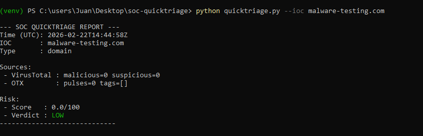
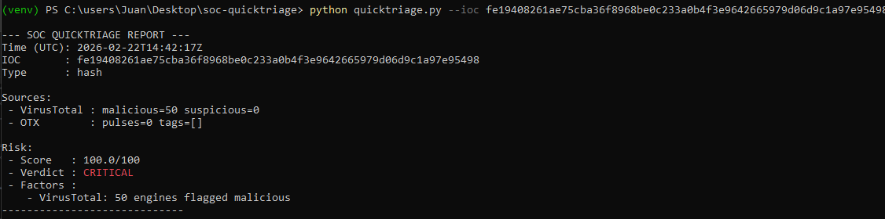
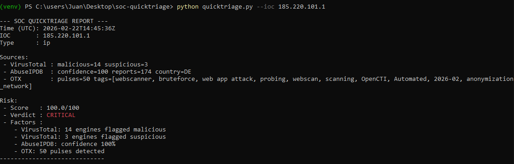
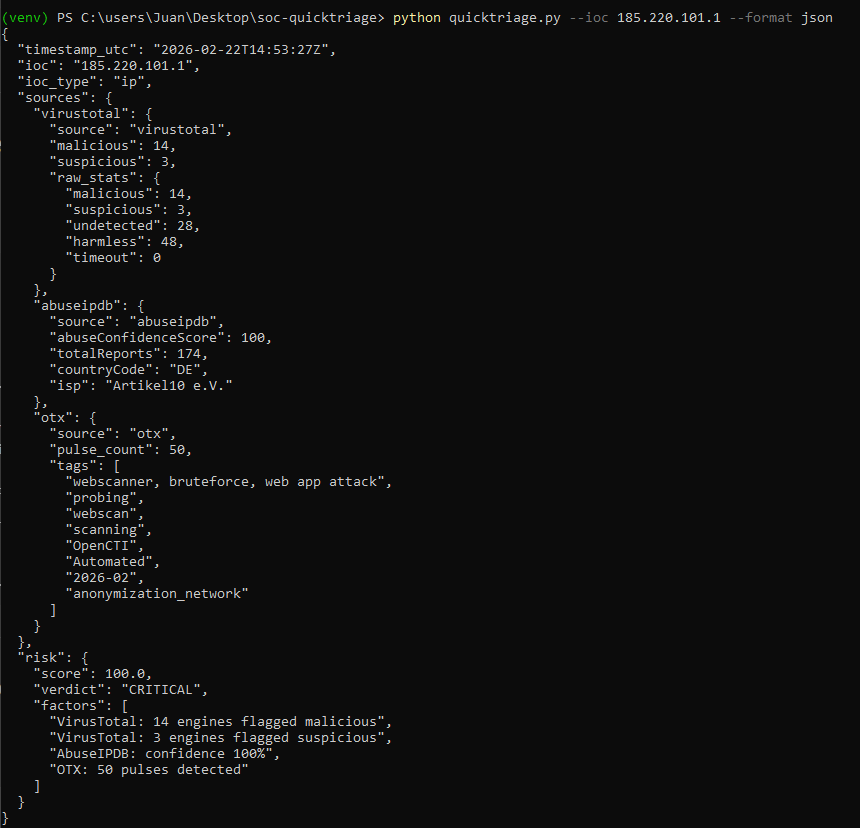

# SOC QuickTriage

*[Read this in English](README.md)*

Diseñado para simular flujos de trabajo reales de triaje de Nivel 1/2 en un SOC, consolidando inteligencia de amenazas de múltiples fuentes y generando una puntuación de riesgo explicable.

## Descripción general

Herramienta de enriquecimiento de IOCs y puntuación de riesgo explicable, diseñada para simular flujos de trabajo reales de triaje en un SOC.

## Problema

Los analistas de Nivel 1 enriquecen manualmente los indicadores en múltiples plataformas, lo que incrementa el tiempo de triaje y retrasa la respuesta.

## Solución

SOC QuickTriage:

- Detecta automáticamente el tipo de IOC
- Enriquece mediante:
  - VirusTotal
  - AbuseIPDB
  - OTX
- Aplica una puntuación de riesgo ponderada
- Genera una salida explicable
- Soporta modo batch
- Exporta a JSON

## Arquitectura

Arquitectura modular simple basada en CLI:

quicktriage.py → módulos de enriquecimiento → motor de puntuación → generador de informes

## Modelo de puntuación de riesgo

El motor de puntuación combina múltiples fuentes de inteligencia:

- VirusTotal:
  - Las detecciones maliciosas tienen un peso alto
  - Las detecciones sospechosas tienen un peso moderado

- AbuseIPDB:
  - La puntuación de confianza de abuso contribuye de forma proporcional

- OTX:
  - El número de *pulses* aporta un incremento de puntuación acotado

La puntuación final está acotada a 100 y se traduce en:

- LOW (<20)
- MEDIUM (20–49)
- HIGH (50–79)
- CRITICAL (80–100)

Puntuación explicable: la herramienta muestra los factores de riesgo que contribuyen al resultado.

## Ejemplos de salida

### LOW – IP limpia


### CRITICAL – Hash malicioso (50 motores de VT)


### CRITICAL – IP correlacionada (VT + AbuseIPDB + OTX)


### Modo de salida JSON


## Uso

```bash
python quicktriage.py --ioc 185.220.101.1
python quicktriage.py --batch iocs.txt
python quicktriage.py --ioc 8.8.8.8 --format json
```

## Hoja de ruta

- Enriquecimiento asíncrono
- Mejoras de caché
- Integración con SOAR
- Etiquetado MITRE ATT&CK

---