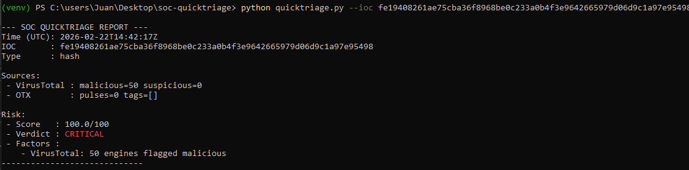
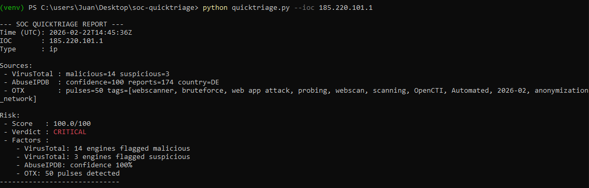
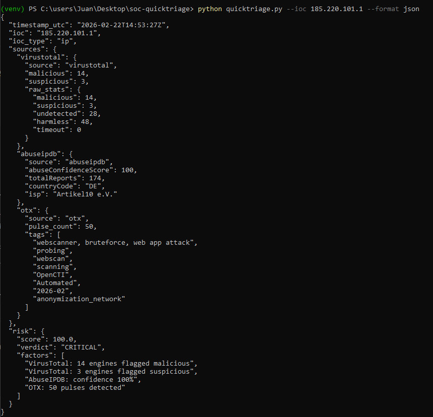

# SOC QuickTriage

Designed to simulate real-world SOC Tier 1/2 triage workflows by consolidating multi-source threat intelligence and producing explainable risk scoring.

## Overview

IOC enrichment and explainable risk scoring tool designed to simulate real-world SOC triage workflows.

## Problem

Tier 1 analysts manually enrich indicators across multiple platforms, increasing triage time and delaying response.

## Solution

SOC QuickTriage:

- Detects IOC type automatically
- Enriches via:
  - VirusTotal
  - AbuseIPDB
  - OTX
- Applies weighted risk scoring
- Produces explainable output
- Supports batch mode
- Exports JSON

## Architecture

Simple CLI-based modular architecture:

quicktriage.py → enrich modules → scoring engine → report builder

## Risk Scoring Model

The scoring engine combines multiple intelligence sources:

- VirusTotal:
  - Malicious detections weighted heavily
  - Suspicious detections weighted moderately

- AbuseIPDB:
  - Abuse confidence score contributes proportionally

- OTX:
  - Pulse count contributes capped score boost

The final score is capped at 100 and mapped to:

- LOW (<20)
- MEDIUM (20–49)
- HIGH (50–79)
- CRITICAL (80–100)

Explainable scoring: the tool outputs contributing risk factors.

## Example Outputs

### LOW – Clean IP


### CRITICAL – Malicious Hash (50 VT engines)


### CRITICAL – Correlated IP (VT + AbuseIPDB + OTX)


### JSON Output Mode


## Usage

```bash
python quicktriage.py --ioc 185.220.101.1
python quicktriage.py --batch iocs.txt
python quicktriage.py --ioc 8.8.8.8 --format json
```

## Roadmap

- Async enrichment
- Caching improvements
- SOAR integration
- MITRE ATT&CK tagging

---

